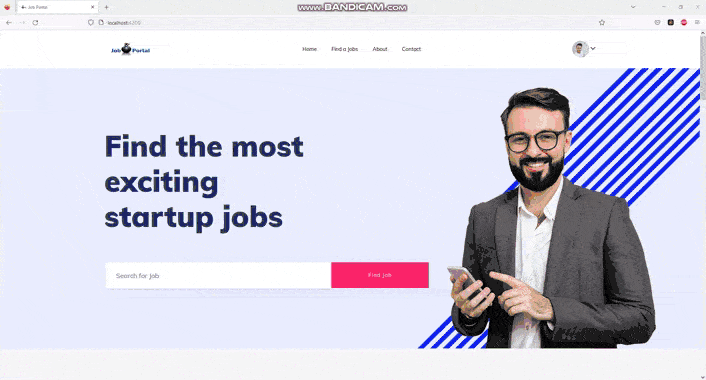
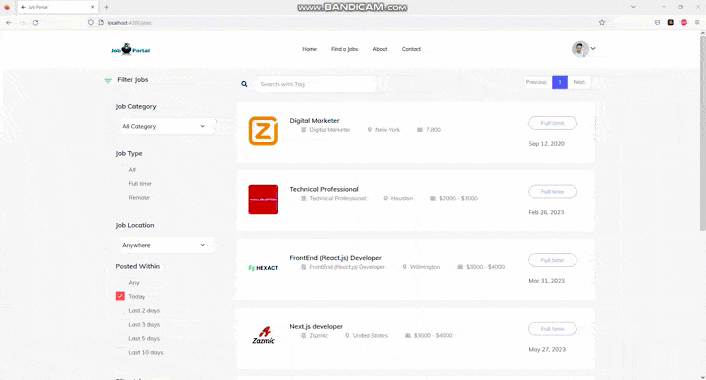
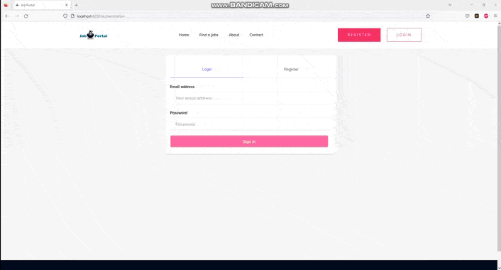

<div align="center">

  
  <h1 >Job Portal </h1>
  
  <p>
    employment platform application
  </p>
  
</div>

<br />

<!-- About the Project -->

## :star2: About the Project

<!-- Screenshots -->

### :camera: Screenshots

<div align="center"> 
  
</div>

<div align="center"> 
  
</div>

<div align="center"> 
  
</div>
<!-- TechStack -->

### :space_invader: Tech Stack

<details>
  <summary>Backend</summary>
  <ul>
    <li><a href="https://angular.io/">Nestjs</a></li>
    <li><a href="https://material.angular.io/">Prisma</a></li>
    <li><a href="https://rxjs.dev/">Postgresql</a></li>
    <li><a href="https://rxjs.dev/">Jwt</a></li>
  </ul>
</details>

<details>
  <summary>👉 Frontend Repo</summary>
     <ul>
  <a href="https://github.com/hicmtrex/Job-Portal">jobportal-frontend</a>
     </ul>
  
</details>

<!-- Features -->

### :dart: Features

- Authentication
- Admin Dashboard
- Admin Content management system

## :toolbox: Getting Started

<!-- Prerequisites -->

### :bangbang: Prerequisites

This project uses Yarn as package manager

```bash
 npm install --global yarn
```

<!-- Installation -->

### :gear: Installation

Install my-project with npm

```bash
  yarn install my-project
  cd my-project
```

<!-- Running Tests -->

### :test_tube: Running Tests

To run tests, run the following command

```bash
  yarn test test
```

<!-- Run Locally -->

### :running: Run Locally

Clone the project

```bash
  git clone https://github.com/hicmtrex/Mean_Shop_Frontend
```

Go to the project directory

```bash
  cd my-project
```

Install dependencies

```bash
  npm install
```

Start the Admin Project

```bash
  npm run admin
```

Start the User Project

```bash
  npm run user
```

<!-- License -->

## :warning: License

Distributed under the License. See LICENSE.txt for more information.

<!-- Contact -->

## :handshake: Contact

Hicm- [@twitter](https://twitter.com/hicmtrex) - hichembouallegue@gmail.com

<!-- Project Link: [https://mean-shop.vercel.app/](https://mean-shop.vercel.app/) -->

## Support

<a href="https://www.buymeacoffee.com/hicmtrex" target="_blank" style="display: inline-block !important;"></a>

Be careful and donate just if it is within your possibilities, because there is no refund system. And remember that you don't need to donate, it is just a free choice for you. Thank you!
